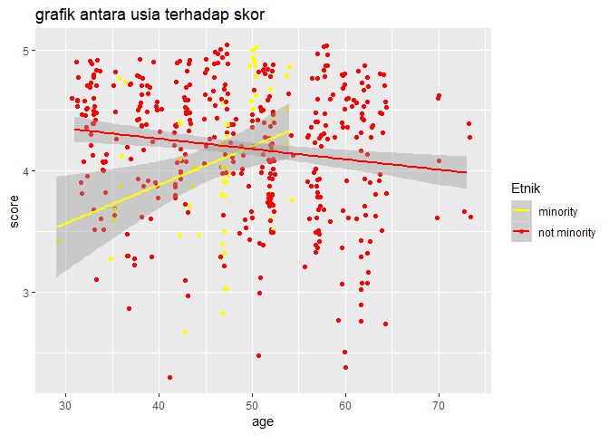

Visualisasi
================
Muhammad Aswan Syahputra
4/9/2019

Dalam modul visualisasi ini, Anda akan menggunakan data `evals` dan
paket `ggplot2`. Aktifkanlah paket untuk mengimpor data dan paket
`ggplot2`\!

``` r
library(tidyverse) #tidyverse bisa untuk semua package plot
```

    ## Warning: package 'tidyverse' was built under R version 3.5.3

    ## -- Attaching packages ---------------------------------------------------------------------------- tidyverse 1.2.1 --

    ## v ggplot2 3.1.1     v purrr   0.3.2
    ## v tibble  2.1.1     v dplyr   0.8.1
    ## v tidyr   0.8.3     v stringr 1.4.0
    ## v readr   1.3.1     v forcats 0.4.0

    ## Warning: package 'ggplot2' was built under R version 3.5.3

    ## Warning: package 'tibble' was built under R version 3.5.3

    ## Warning: package 'tidyr' was built under R version 3.5.3

    ## Warning: package 'readr' was built under R version 3.5.3

    ## Warning: package 'purrr' was built under R version 3.5.3

    ## Warning: package 'dplyr' was built under R version 3.5.3

    ## Warning: package 'stringr' was built under R version 3.5.3

    ## Warning: package 'forcats' was built under R version 3.5.3

    ## -- Conflicts ------------------------------------------------------------------------------- tidyverse_conflicts() --
    ## x dplyr::filter() masks stats::filter()
    ## x dplyr::lag()    masks stats::lag()

``` r
library(readr)
library(ggplot2)
```

Sekarang impor dataset `evals` melalui pranala
“<https://www.openintro.org/stat/data/evals.csv>”. Simpan obyek data
tersebut dengan nama `evals`. (Petunjuk:
`?read_csv`)

``` r
evals <- read.csv("https://www.openintro.org/stat/data/evals.csv") #antara readcsv dan setelahnya jgn spasi
evals
```

    ##     score         rank    ethnicity gender    language age cls_perc_eval
    ## 1     4.7 tenure track     minority female     english  36      55.81395
    ## 2     4.1 tenure track     minority female     english  36      68.80000
    ## 3     3.9 tenure track     minority female     english  36      60.80000
    ## 4     4.8 tenure track     minority female     english  36      62.60163
    ## 5     4.6      tenured not minority   male     english  59      85.00000
    ## 6     4.3      tenured not minority   male     english  59      87.50000
    ## 7     2.8      tenured not minority   male     english  59      88.63636
    ## 8     4.1      tenured not minority   male     english  51     100.00000
    ## 9     3.4      tenured not minority   male     english  51      56.92308
    ## 10    4.5      tenured not minority female     english  40      86.95652
    ## 11    3.8      tenured not minority female     english  40      88.88889
    ## 12    4.5      tenured not minority female     english  40      96.00000
    ## 13    4.6      tenured not minority female     english  40      85.00000
    ## 14    3.9      tenured not minority female     english  40      56.00000
    ## 15    3.9      tenured not minority female     english  40      88.09524
    ## 16    4.3      tenured not minority female     english  40      90.00000
    ## 17    4.5      tenured not minority female     english  40      83.33334
    ## 18    4.8 tenure track not minority female     english  31      87.50000
    ## 19    4.6 tenure track not minority female     english  31      90.90909
    ## 20    4.6 tenure track not minority female     english  31      79.16666
    ## 21    4.9 tenure track not minority female     english  31      88.88889
    ## 22    4.6 tenure track not minority female     english  31      88.13559
    ## 23    4.5 tenure track not minority female     english  31      56.32184
    ## 24    4.4      tenured not minority   male     english  62      64.53901
    ## 25    4.6      tenured not minority   male     english  62      54.79452
    ## 26    4.7      tenured not minority   male     english  62      60.76923
    ## 27    4.5      tenured not minority   male     english  62      61.75439
    ## 28    4.8      tenured not minority   male     english  62      56.98529
    ## 29    4.9      tenured not minority   male     english  62      58.04196
    ## 30    4.5      tenured not minority   male     english  62      61.58941
    ## 31    4.4 tenure track not minority female     english  33      80.48781
    ## 32    4.3 tenure track not minority female     english  33      85.29412
    ## 33    4.1 tenure track not minority female     english  33      90.24390
    ## 34    4.2 tenure track not minority female     english  33      70.73170
    ## 35    3.5 tenure track not minority female     english  33      82.35294
    ## 36    3.4      tenured not minority female     english  51      60.97561
    ## 37    4.5      tenured not minority female     english  51      95.45454
    ## 38    4.4      tenured not minority female     english  51      61.90476
    ## 39    4.4      tenured not minority female     english  51      94.11765
    ## 40    2.5      tenured not minority female     english  51      80.00000
    ## 41    4.3      tenured not minority female     english  51     100.00000
    ## 42    4.5      tenured not minority female     english  51     100.00000
    ## 43    4.8 tenure track not minority female     english  33      80.00000
    ## 44    4.8 tenure track not minority female     english  33      87.87878
    ## 45    4.4 tenure track not minority female     english  33      25.00000
    ## 46    4.7 tenure track not minority female     english  33      59.18367
    ## 47    4.4 tenure track not minority female     english  33      86.20689
    ## 48    4.7 tenure track not minority female     english  33      87.50000
    ## 49    4.5 tenure track not minority female     english  33      85.00000
    ## 50    4.0     teaching not minority   male     english  47      84.21053
    ## 51    4.3     teaching not minority   male     english  47      75.00000
    ## 52    4.4     teaching not minority   male     english  47      93.33334
    ## 53    4.5     teaching not minority   male     english  47      95.65218
    ## 54    5.0     teaching not minority   male     english  47      90.90909
    ## 55    4.9     teaching not minority   male     english  47      58.62069
    ## 56    4.6     teaching not minority   male     english  47      76.19048
    ## 57    5.0     teaching not minority   male     english  47      83.33334
    ## 58    4.7     teaching not minority   male     english  47      84.21053
    ## 59    5.0     teaching not minority   male     english  47      80.00000
    ## 60    3.6 tenure track     minority   male non-english  35      72.00000
    ## 61    3.7 tenure track     minority   male non-english  35      90.90909
    ## 62    4.3 tenure track     minority   male non-english  35      95.83334
    ## 63    4.1     teaching not minority   male     english  37      88.23529
    ## 64    4.2     teaching not minority   male     english  37      61.90476
    ## 65    4.7     teaching not minority   male     english  37      80.00000
    ## 66    4.7     teaching not minority   male     english  37      96.00000
    ## 67    3.5     teaching not minority   male     english  37      71.42857
    ## 68    4.1      tenured not minority   male     english  42      70.00000
    ## 69    4.2      tenured not minority   male     english  42      60.00000
    ## 70    4.0      tenured not minority   male     english  42      66.66666
    ## 71    4.0      tenured not minority   male     english  42      43.85965
    ## 72    3.9      tenured not minority   male     english  42      70.17544
    ## 73    4.4      tenured not minority   male     english  42      78.43137
    ## 74    3.8      tenured not minority   male     english  42      60.00000
    ## 75    3.5      tenured not minority   male non-english  49      83.33334
    ## 76    4.2      tenured not minority   male non-english  49      83.78378
    ## 77    3.5      tenured not minority   male non-english  49      51.72414
    ## 78    3.6      tenured not minority   male non-english  49      85.18519
    ## 79    2.9 tenure track not minority female     english  37      82.14286
    ## 80    3.3 tenure track not minority female     english  37      65.38461
    ## 81    3.3 tenure track not minority female     english  37      80.76923
    ## 82    3.2 tenure track not minority female     english  37      96.66666
    ## 83    4.6      tenured not minority   male     english  45      69.69697
    ## 84    4.2      tenured not minority   male     english  45      25.42373
    ## 85    4.3      tenured not minority   male     english  45      45.22613
    ## 86    4.4      tenured not minority   male     english  45      84.37500
    ## 87    4.1      tenured not minority   male     english  45      94.59460
    ## 88    4.6      tenured not minority   male     english  45      74.53416
    ## 89    4.4     teaching not minority female     english  56      65.85366
    ## 90    4.8     teaching not minority female     english  56      88.63636
    ## 91    4.3     teaching not minority female     english  56      66.03773
    ## 92    3.6     teaching not minority female     english  56      69.38776
    ## 93    4.3     teaching not minority female     english  56      84.37500
    ## 94    4.0     teaching not minority   male     english  48      74.07407
    ## 95    4.2     teaching not minority   male     english  48      60.60606
    ## 96    4.1     teaching not minority   male     english  48      73.68421
    ## 97    4.1     teaching not minority   male     english  48      58.55856
    ## 98    4.4     teaching not minority   male     english  48      63.75839
    ## 99    4.3     teaching not minority   male     english  48      66.66666
    ## 100   4.4     teaching not minority   male     english  48      62.50000
    ## 101   4.4     teaching not minority   male     english  48      80.71429
    ## 102   4.9      tenured not minority female     english  46      80.64516
    ## 103   5.0      tenured not minority female     english  46      93.33334
    ## 104   4.4      tenured not minority female     english  46      79.31035
    ## 105   4.8      tenured not minority female     english  46      92.00000
    ## 106   4.9      tenured not minority female     english  46      50.00000
    ## 107   4.3      tenured not minority female     english  46      66.66666
    ## 108   5.0      tenured not minority female     english  46     100.00000
    ## 109   4.7      tenured not minority female     english  46      81.57895
    ## 110   4.5      tenured not minority female     english  46      80.00000
    ## 111   3.5     teaching not minority female     english  57      60.71429
    ## 112   3.9     teaching not minority female     english  57      43.47826
    ## 113   4.0     teaching not minority female     english  57      78.94736
    ## 114   4.0     teaching not minority female     english  57      30.43478
    ## 115   3.7     teaching not minority female     english  57      31.81818
    ## 116   3.4     teaching not minority female     english  57      70.00000
    ## 117   3.3     teaching not minority female     english  57      42.10526
    ## 118   3.8     teaching not minority female     english  57      73.91304
    ## 119   3.9     teaching not minority female     english  57      45.45454
    ## 120   3.4     teaching not minority female     english  57      80.00000
    ## 121   3.7     teaching not minority female     english  52      86.36364
    ## 122   4.1     teaching not minority female     english  52      87.09677
    ## 123   3.7     teaching not minority female     english  52      95.23810
    ## 124   3.5     teaching not minority female     english  52      86.11111
    ## 125   3.5     teaching not minority female     english  52      89.47369
    ## 126   4.4     teaching not minority female     english  52      62.16216
    ## 127   3.4 tenure track     minority female non-english  29      73.07692
    ## 128   4.3      tenured not minority   male     english  62      76.92308
    ## 129   3.7      tenured not minority   male     english  62      51.08696
    ## 130   4.7      tenured not minority   male     english  62      92.00000
    ## 131   3.9      tenured not minority   male     english  62      50.95541
    ## 132   3.6      tenured not minority   male     english  62      37.19512
    ## 133   4.5      tenured not minority   male     english  64      62.50000
    ## 134   4.5      tenured not minority   male     english  64      75.00000
    ## 135   4.8      tenured not minority   male     english  64      46.80851
    ## 136   4.8      tenured not minority   male     english  64      71.42857
    ## 137   4.7      tenured not minority   male     english  64      73.33334
    ## 138   4.5      tenured not minority   male     english  64      62.50000
    ## 139   4.3      tenured not minority   male     english  64      53.84615
    ## 140   4.8 tenure track not minority female     english  34      76.92308
    ## 141   4.1 tenure track not minority female     english  34      82.50000
    ## 142   4.4      tenured not minority   male     english  58      52.83019
    ## 143   4.3      tenured not minority   male     english  58      47.01987
    ## 144   3.6      tenured not minority   male     english  58      76.59574
    ## 145   4.5      tenured not minority   male     english  58      59.83607
    ## 146   4.3      tenured not minority   male     english  58      68.88889
    ## 147   4.4      tenured     minority   male non-english  52      81.25000
    ## 148   4.7      tenured     minority   male non-english  52     100.00000
    ## 149   4.8      tenured     minority   male non-english  52      75.00000
    ## 150   3.5      tenured     minority   male non-english  52      83.33334
    ## 151   3.8      tenured     minority   male non-english  52      68.75000
    ## 152   3.6      tenured     minority   male non-english  52      80.00000
    ## 153   4.2      tenured     minority   male non-english  52      64.28571
    ## 154   3.6      tenured not minority   male     english  73      70.58823
    ## 155   4.4      tenured not minority   male     english  73      76.92308
    ## 156   3.7      tenured not minority   male     english  73      76.19048
    ## 157   4.3      tenured not minority   male     english  73      76.47059
    ## 158   4.6      tenured not minority   male     english  70      35.07463
    ## 159   4.6      tenured not minority   male     english  70      10.41667
    ## 160   4.1      tenured not minority   male     english  70      53.12500
    ## 161   3.6      tenured not minority   male     english  70      34.78261
    ## 162   2.3 tenure track not minority female     english  41      83.33334
    ## 163   4.3     teaching not minority   male     english  63      65.11628
    ## 164   4.4     teaching not minority   male     english  63      78.57143
    ## 165   3.6     teaching not minority   male     english  63      66.66666
    ## 166   4.4     teaching not minority   male     english  63      77.77778
    ## 167   3.9     teaching not minority   male     english  63      75.00000
    ## 168   3.8     teaching not minority   male     english  63      80.00000
    ## 169   3.4     teaching not minority   male     english  63      48.93617
    ## 170   4.9      tenured not minority   male     english  47      66.66666
    ## 171   4.1      tenured not minority   male     english  47      71.42857
    ## 172   3.2      tenured not minority   male     english  47      83.33334
    ## 173   4.2      tenured not minority   male     english  39      34.95935
    ## 174   3.9      tenured not minority   male     english  39      48.73418
    ## 175   4.9      tenured not minority   male     english  39      80.00000
    ## 176   4.7      tenured not minority   male     english  39      93.33334
    ## 177   4.4      tenured not minority   male     english  39      93.10345
    ## 178   4.2 tenure track     minority female     english  47     100.00000
    ## 179   4.0 tenure track     minority female     english  47     100.00000
    ## 180   4.4 tenure track     minority female     english  47     100.00000
    ## 181   3.9 tenure track     minority female     english  47      92.30769
    ## 182   4.4 tenure track     minority female     english  47      70.00000
    ## 183   3.0 tenure track     minority female     english  47      96.15385
    ## 184   3.5 tenure track     minority female     english  47      92.30769
    ## 185   2.8 tenure track     minority female     english  47      92.30769
    ## 186   4.6 tenure track     minority female     english  47      95.23810
    ## 187   4.3 tenure track     minority female     english  47     100.00000
    ## 188   3.4 tenure track     minority female     english  47      92.59259
    ## 189   3.0 tenure track     minority female     english  47      96.29630
    ## 190   4.2 tenure track     minority female     english  47      96.00000
    ## 191   4.3      tenured not minority   male     english  54     100.00000
    ## 192   4.1      tenured not minority   male     english  54      66.66666
    ## 193   4.6      tenured not minority   male     english  54      94.11765
    ## 194   3.9      tenured     minority female     english  44      54.54546
    ## 195   3.5      tenured     minority female     english  44      72.91666
    ## 196   4.0      tenured     minority female     english  44     100.00000
    ## 197   4.0      tenured     minority female     english  44      89.74359
    ## 198   3.9      tenured     minority   male     english  47      74.07407
    ## 199   3.3      tenured     minority   male     english  47      64.28571
    ## 200   4.0      tenured     minority   male     english  47      80.76923
    ## 201   3.8      tenured     minority   male     english  47      81.25000
    ## 202   4.2      tenured     minority   male     english  47      81.25000
    ## 203   4.0      tenured     minority   male     english  47      92.30769
    ## 204   3.8      tenured     minority   male     english  47     100.00000
    ## 205   3.3      tenured     minority   male     english  47      88.23529
    ## 206   4.1      tenured not minority   male     english  62      92.30769
    ## 207   4.7      tenured not minority   male     english  62      86.66666
    ## 208   4.4      tenured not minority   male     english  62      70.00000
    ## 209   4.8      tenured not minority   male     english  60      73.52941
    ## 210   4.8      tenured not minority   male     english  60      75.00000
    ## 211   4.6      tenured not minority   male     english  60      78.57143
    ## 212   4.6      tenured not minority   male     english  60      66.66666
    ## 213   4.8      tenured not minority   male     english  60      61.53846
    ## 214   4.4      tenured not minority   male     english  60      42.85714
    ## 215   4.7      tenured not minority   male     english  60      68.88889
    ## 216   4.7      tenured not minority   male     english  60      80.00000
    ## 217   3.3 tenure track not minority   male     english  37      88.23529
    ## 218   4.4 tenure track not minority   male     english  42      92.85714
    ## 219   4.3 tenure track not minority   male     english  42     100.00000
    ## 220   4.9 tenure track not minority   male     english  42      92.85714
    ## 221   4.4 tenure track not minority   male     english  42     100.00000
    ## 222   4.7 tenure track not minority   male     english  42      86.66666
    ## 223   4.3      tenured not minority   male     english  35      82.35294
    ## 224   4.8      tenured not minority   male     english  35      91.30434
    ## 225   4.5      tenured not minority   male     english  35      85.96491
    ## 226   4.7      tenured not minority   male     english  35      88.00000
    ## 227   3.3     teaching not minority female     english  39      91.66666
    ## 228   4.7     teaching not minority female     english  39      78.26087
    ## 229   4.6     teaching not minority female     english  39      86.95652
    ## 230   3.6     teaching not minority female     english  39      96.42857
    ## 231   4.0      tenured not minority   male     english  49      62.22222
    ## 232   4.1      tenured not minority   male     english  49      64.28571
    ## 233   4.0      tenured not minority   male     english  49      85.96491
    ## 234   4.5      tenured not minority   male     english  61      81.48148
    ## 235   4.6      tenured not minority   male     english  61      81.57895
    ## 236   4.8      tenured not minority   male     english  61      86.36364
    ## 237   4.6      tenured not minority   male     english  61      62.79070
    ## 238   4.9 tenure track not minority   male     english  33      96.77419
    ## 239   3.1 tenure track not minority   male     english  33      92.30769
    ## 240   3.7 tenure track not minority   male     english  33      86.66666
    ## 241   3.7      tenured not minority female     english  58      76.47059
    ## 242   3.9      tenured not minority female     english  56      63.15789
    ## 243   3.9      tenured not minority female     english  56      80.00000
    ## 244   3.2      tenured not minority female     english  56      73.91304
    ## 245   4.4     teaching not minority female     english  50      81.48148
    ## 246   4.2     teaching not minority female     english  50      75.00000
    ## 247   4.7     teaching not minority female     english  50      66.66666
    ## 248   3.9     teaching not minority female     english  50      95.83334
    ## 249   3.6     teaching not minority female     english  50      90.47619
    ## 250   3.4     teaching not minority female     english  50      64.28571
    ## 251   4.4     teaching not minority female     english  50      79.31035
    ## 252   4.4      tenured not minority   male     english  52      85.07462
    ## 253   4.1      tenured not minority   male     english  52      91.01124
    ## 254   3.6      tenured not minority   male     english  52      90.24390
    ## 255   3.5      tenured not minority   male     english  52      83.60656
    ## 256   4.1      tenured not minority   male     english  52      71.75572
    ## 257   3.8      tenured not minority   male     english  52      78.07018
    ## 258   4.0      tenured not minority   male     english  52      89.26174
    ## 259   4.8      tenured not minority   male     english  52      95.65218
    ## 260   4.2      tenured not minority   male     english  52      79.59184
    ## 261   4.6      tenured not minority   male     english  52      81.48148
    ## 262   4.3      tenured not minority   male     english  52      90.00000
    ## 263   4.8      tenured not minority   male     english  52      90.00000
    ## 264   3.8      tenured not minority   male     english  52      86.95652
    ## 265   4.5 tenure track not minority female     english  33      66.66666
    ## 266   4.9 tenure track not minority female     english  33     100.00000
    ## 267   4.9 tenure track not minority female     english  33      90.90909
    ## 268   4.8 tenure track not minority female     english  33      71.42857
    ## 269   4.7 tenure track not minority female     english  33      63.63636
    ## 270   4.6 tenure track not minority female     english  33     100.00000
    ## 271   4.3      tenured not minority   male     english  57      89.61039
    ## 272   4.4      tenured not minority   male     english  57      87.80488
    ## 273   4.5      tenured not minority   male     english  57      81.81818
    ## 274   4.2      tenured not minority   male     english  57      80.76923
    ## 275   4.8      tenured not minority female     english  38      70.76923
    ## 276   4.6      tenured not minority female     english  38      69.42675
    ## 277   4.9      tenured not minority female     english  38      79.41177
    ## 278   4.8      tenured not minority female     english  38      76.11940
    ## 279   4.8      tenured not minority female     english  38      76.25000
    ## 280   4.6      tenured not minority female     english  38      74.45255
    ## 281   4.7      tenured not minority female     english  38      84.05797
    ## 282   4.1 tenure track not minority female     english  34      59.34066
    ## 283   3.8 tenure track not minority female     english  34      57.50000
    ## 284   4.0 tenure track not minority female     english  34      58.88889
    ## 285   4.1 tenure track not minority female     english  34      55.88235
    ## 286   4.0 tenure track not minority female     english  34      56.16438
    ## 287   4.1 tenure track not minority female     english  34      56.81818
    ## 288   3.5 tenure track not minority   male     english  34      66.66666
    ## 289   4.1 tenure track not minority   male     english  34      80.00000
    ## 290   3.6 tenure track not minority   male     english  34      57.14286
    ## 291   4.0 tenure track not minority   male     english  32      34.27419
    ## 292   3.9 tenure track not minority   male     english  32      41.07143
    ## 293   3.8 tenure track not minority   male     english  32      39.67611
    ## 294   4.4 tenure track not minority   male     english  32      90.90909
    ## 295   4.7 tenure track not minority   male     english  32      69.90292
    ## 296   3.8      tenured not minority female     english  42      70.96774
    ## 297   4.1      tenured not minority female     english  42      62.19512
    ## 298   4.1      tenured not minority female     english  43      68.62745
    ## 299   4.7      tenured not minority female     english  43      51.42857
    ## 300   4.3      tenured not minority female     english  43      76.47059
    ## 301   4.4      tenured not minority female     english  43      75.67567
    ## 302   4.5      tenured not minority female     english  43      92.85714
    ## 303   3.1      tenured not minority female     english  43      65.41354
    ## 304   3.7      tenured not minority female     english  43      67.32284
    ## 305   4.5      tenured not minority female     english  43      76.92308
    ## 306   3.0      tenured not minority female     english  43      58.86525
    ## 307   4.6      tenured not minority female     english  43     100.00000
    ## 308   3.7 tenure track not minority   male non-english  35      57.89474
    ## 309   3.6 tenure track not minority   male non-english  35      52.38095
    ## 310   3.2      tenured not minority female     english  62      81.48148
    ## 311   3.3      tenured not minority female     english  62      56.25000
    ## 312   2.9      tenured not minority female     english  62      73.68421
    ## 313   4.2      tenured not minority   male     english  42      52.32558
    ## 314   4.5      tenured not minority   male     english  39      75.86207
    ## 315   3.8      tenured not minority female     english  52      72.72727
    ## 316   3.7      tenured not minority female     english  52      71.42857
    ## 317   3.7      tenured not minority female     english  52      70.45454
    ## 318   4.0      tenured not minority female     english  52      75.38461
    ## 319   3.7      tenured not minority female     english  52      50.79365
    ## 320   4.5     teaching not minority female     english  52      78.66666
    ## 321   3.8     teaching not minority female     english  52      81.39535
    ## 322   3.9     teaching not minority female     english  52      73.75000
    ## 323   4.6     teaching not minority female     english  52      86.53846
    ## 324   4.5     teaching not minority female     english  52      70.83334
    ## 325   4.2     teaching not minority female     english  52      75.75758
    ## 326   4.0     teaching not minority female     english  52      67.00000
    ## 327   3.8      tenured not minority   male     english  64      81.81818
    ## 328   3.5      tenured not minority   male     english  64      50.00000
    ## 329   2.7      tenured not minority   male     english  64      81.81818
    ## 330   4.0      tenured not minority   male     english  64      45.45454
    ## 331   4.6      tenured not minority   male     english  64      50.00000
    ## 332   3.9      tenured not minority   male     english  64     100.00000
    ## 333   4.5      tenured not minority   male     english  50      93.75000
    ## 334   3.7      tenured not minority   male     english  50      90.00000
    ## 335   2.4      tenured not minority   male     english  60      71.87500
    ## 336   3.1      tenured not minority   male     english  60      70.00000
    ## 337   2.5      tenured not minority   male     english  60      62.50000
    ## 338   3.0      tenured not minority female     english  51      70.14925
    ## 339   4.5 tenure track not minority   male     english  43      86.36364
    ## 340   4.8 tenure track not minority   male     english  43      53.57143
    ## 341   4.9 tenure track not minority   male     english  43      60.00000
    ## 342   4.5 tenure track not minority   male     english  43      73.33334
    ## 343   4.6 tenure track not minority   male     english  43      76.92308
    ## 344   4.5 tenure track not minority   male     english  43      94.44444
    ## 345   4.9 tenure track not minority   male     english  43      84.61539
    ## 346   4.4 tenure track not minority   male     english  43      60.00000
    ## 347   4.6 tenure track not minority   male     english  43     100.00000
    ## 348   4.6     teaching     minority   male     english  50      70.83334
    ## 349   5.0     teaching     minority   male     english  50      90.90909
    ## 350   4.9     teaching     minority   male     english  50      84.00000
    ## 351   4.6     teaching     minority   male     english  50      88.46154
    ## 352   4.8     teaching     minority   male     english  50      86.36364
    ## 353   4.9     teaching     minority   male     english  50      76.92308
    ## 354   4.9     teaching     minority   male     english  50      85.00000
    ## 355   4.9     teaching     minority   male     english  50      81.81818
    ## 356   5.0     teaching     minority   male     english  50      95.23810
    ## 357   4.5     teaching     minority   male     english  50      90.47619
    ## 358   3.5      tenured not minority   male     english  52      66.66666
    ## 359   3.8      tenured not minority   male     english  52      70.76923
    ## 360   3.9      tenured not minority   male     english  52      62.90322
    ## 361   3.9      tenured not minority   male     english  52      50.74627
    ## 362   4.2      tenured not minority   male     english  52      72.50000
    ## 363   4.1      tenured not minority   male     english  52      60.00000
    ## 364   4.8      tenured not minority   male     english  51      60.62718
    ## 365   4.8      tenured not minority   male     english  51      64.24870
    ## 366   4.8      tenured not minority   male     english  51      63.87337
    ## 367   4.8      tenured not minority   male     english  51      65.40447
    ## 368   4.9      tenured not minority   male     english  51      61.10057
    ## 369   4.2      tenured not minority   male     english  38      50.57471
    ## 370   4.5      tenured not minority   male     english  38      78.57143
    ## 371   3.9      tenured not minority   male     english  38      50.63291
    ## 372   4.4      tenured not minority   male     english  38      65.21739
    ## 373   4.0      tenured not minority female     english  47      79.16666
    ## 374   3.6      tenured not minority female     english  47      56.71642
    ## 375   3.7      tenured     minority female     english  43      45.63107
    ## 376   2.7      tenured     minority female     english  43      48.94737
    ## 377   4.5     teaching not minority female     english  38      48.52941
    ## 378   4.4     teaching not minority female     english  38      60.00000
    ## 379   3.9     teaching not minority female     english  38      45.31250
    ## 380   3.6     teaching not minority female     english  38      74.19355
    ## 381   4.4     teaching not minority female     english  38      58.06452
    ## 382   4.4     teaching not minority female     english  38      81.08108
    ## 383   4.7      tenured not minority   male     english  43      76.92308
    ## 384   4.5      tenured not minority   male     english  43      61.53846
    ## 385   4.1      tenured not minority   male     english  43      80.00000
    ## 386   3.7      tenured not minority   male     english  43      82.27848
    ## 387   4.3      tenured not minority   male     english  57      53.84615
    ## 388   3.5      tenured not minority   male     english  57      54.08163
    ## 389   3.7      tenured not minority   male     english  57      59.79382
    ## 390   4.0      tenured not minority female     english  51      81.81818
    ## 391   4.0      tenured not minority female     english  51      85.89744
    ## 392   3.1      tenured not minority female     english  51      64.28571
    ## 393   4.5      tenured not minority female     english  51      85.00000
    ## 394   4.8     teaching not minority   male     english  45      70.58823
    ## 395   4.2     teaching not minority   male     english  45      85.00000
    ## 396   4.9     teaching not minority   male     english  45      68.42105
    ## 397   4.8     teaching not minority   male     english  45      73.07692
    ## 398   3.5      tenured not minority   male     english  57      92.85714
    ## 399   3.6      tenured not minority   male     english  57      66.66666
    ## 400   4.4      tenured not minority   male     english  57     100.00000
    ## 401   3.4      tenured not minority   male     english  57      84.21053
    ## 402   3.9      tenured not minority   male     english  57      75.00000
    ## 403   3.8      tenured not minority   male     english  57      87.50000
    ## 404   4.8      tenured not minority   male     english  57      91.66666
    ## 405   4.6      tenured not minority   male     english  57      88.23529
    ## 406   5.0      tenured not minority   male     english  57      40.00000
    ## 407   3.8      tenured not minority   male     english  57      93.75000
    ## 408   4.2      tenured not minority   male     english  57      70.58823
    ## 409   3.3     teaching not minority female     english  47      76.19048
    ## 410   4.7     teaching not minority female     english  47      88.23529
    ## 411   4.6     teaching not minority female     english  47     100.00000
    ## 412   4.6     teaching not minority female     english  47      94.11765
    ## 413   4.0     teaching not minority female     english  47      88.23529
    ## 414   4.2      tenured     minority female     english  54     100.00000
    ## 415   4.9      tenured     minority female     english  54      93.75000
    ## 416   4.5      tenured     minority female     english  54      80.76923
    ## 417   4.8      tenured     minority female     english  54      77.77778
    ## 418   3.8      tenured     minority female     english  54      80.00000
    ## 419   4.8     teaching not minority   male     english  58      94.11765
    ## 420   5.0     teaching not minority   male     english  58     100.00000
    ## 421   5.0     teaching not minority   male     english  58      85.71429
    ## 422   4.9     teaching not minority   male     english  58      85.00000
    ## 423   4.6     teaching not minority   male     english  58      95.00000
    ## 424   5.0     teaching not minority   male     english  58      84.61539
    ## 425   4.8     teaching not minority   male     english  58      87.50000
    ## 426   4.9     teaching not minority   male     english  58      94.11765
    ## 427   4.9      tenured not minority   male     english  42      83.33334
    ## 428   3.9      tenured not minority   male     english  42      91.66666
    ## 429   3.9      tenured not minority   male     english  42      85.00000
    ## 430   4.5 tenure track not minority   male     english  33      70.83334
    ## 431   4.5 tenure track not minority   male     english  33      43.22581
    ## 432   3.3      tenured not minority   male     english  62      28.94737
    ## 433   3.1      tenured not minority   male     english  62      40.00000
    ## 434   2.8      tenured not minority   male     english  62      40.93960
    ## 435   3.1      tenured not minority   male     english  62      35.76642
    ## 436   4.2      tenured not minority   male     english  62      44.82759
    ## 437   3.4      tenured not minority   male     english  62      50.90909
    ## 438   3.0      tenured not minority   male     english  62      49.26471
    ## 439   3.3 tenure track     minority female     english  35      62.50000
    ## 440   3.6 tenure track     minority female     english  35      33.33333
    ## 441   3.7 tenure track     minority female     english  35      39.81482
    ## 442   3.6      tenured not minority   male     english  61      69.23077
    ## 443   4.3      tenured not minority   male     english  61      86.66666
    ## 444   4.1      tenured not minority female     english  52      54.95496
    ## 445   4.9      tenured not minority female     english  52      82.35294
    ## 446   4.8      tenured not minority female     english  52     100.00000
    ## 447   3.7 tenure track not minority female non-english  60      85.18519
    ## 448   3.9 tenure track not minority female non-english  60      94.73684
    ## 449   4.5 tenure track not minority female non-english  60      84.61539
    ## 450   3.6 tenure track not minority female non-english  60      94.73684
    ## 451   4.4 tenure track not minority female non-english  60      50.00000
    ## 452   3.4 tenure track not minority female non-english  60      35.00000
    ## 453   4.4 tenure track not minority female non-english  60      88.88889
    ## 454   4.5 tenure track not minority   male     english  32      74.24242
    ## 455   4.5 tenure track not minority   male     english  32      87.40157
    ## 456   4.5 tenure track not minority   male     english  32      72.94118
    ## 457   4.6 tenure track not minority   male     english  32      75.24753
    ## 458   4.1 tenure track not minority   male     english  32      42.85714
    ## 459   4.5 tenure track not minority   male     english  32      60.46511
    ## 460   3.5 tenure track     minority female non-english  42      57.14286
    ## 461   4.4 tenure track     minority female non-english  42      77.61194
    ## 462   4.4 tenure track     minority female non-english  42      81.81818
    ## 463   4.1 tenure track     minority female non-english  42      80.00000
    ##     cls_did_eval cls_students cls_level cls_profs  cls_credits bty_f1lower
    ## 1             24           43     upper    single multi credit           5
    ## 2             86          125     upper    single multi credit           5
    ## 3             76          125     upper    single multi credit           5
    ## 4             77          123     upper    single multi credit           5
    ## 5             17           20     upper  multiple multi credit           4
    ## 6             35           40     upper  multiple multi credit           4
    ## 7             39           44     upper  multiple multi credit           4
    ## 8             55           55     upper    single multi credit           5
    ## 9            111          195     upper    single multi credit           5
    ## 10            40           46     upper    single multi credit           2
    ## 11            24           27     upper    single multi credit           2
    ## 12            24           25     upper  multiple multi credit           2
    ## 13            17           20     upper    single multi credit           2
    ## 14            14           25     upper    single multi credit           2
    ## 15            37           42     upper    single multi credit           2
    ## 16            18           20     upper  multiple multi credit           2
    ## 17            15           18     upper  multiple multi credit           2
    ## 18            42           48     upper  multiple multi credit           7
    ## 19            40           44     upper  multiple multi credit           7
    ## 20            38           48     upper  multiple multi credit           7
    ## 21            40           45     upper  multiple multi credit           7
    ## 22            52           59     upper  multiple multi credit           7
    ## 23            49           87     upper    single multi credit           7
    ## 24           182          282     upper  multiple multi credit           6
    ## 25           160          292     upper  multiple multi credit           6
    ## 26            79          130     upper  multiple multi credit           6
    ## 27           176          285     upper    single multi credit           6
    ## 28           155          272     upper  multiple multi credit           6
    ## 29           166          286     upper  multiple multi credit           6
    ## 30           186          302     upper    single multi credit           6
    ## 31            33           41     upper    single multi credit           4
    ## 32            29           34     upper    single multi credit           4
    ## 33            37           41     upper    single multi credit           4
    ## 34            29           41     upper    single multi credit           4
    ## 35            28           34     upper    single multi credit           4
    ## 36            25           41     upper  multiple multi credit           4
    ## 37            21           22     upper  multiple multi credit           4
    ## 38            13           21     upper  multiple multi credit           4
    ## 39            16           17     upper  multiple multi credit           4
    ## 40            24           30     lower  multiple multi credit           4
    ## 41            23           23     upper  multiple multi credit           4
    ## 42            20           20     upper  multiple multi credit           4
    ## 43            48           60     upper  multiple multi credit           3
    ## 44            29           33     upper    single multi credit           3
    ## 45            11           44     upper  multiple multi credit           3
    ## 46            29           49     upper    single multi credit           3
    ## 47            25           29     upper    single multi credit           3
    ## 48            42           48     upper  multiple multi credit           3
    ## 49            34           40     upper  multiple multi credit           3
    ## 50            16           19     upper    single multi credit           5
    ## 51            12           16     upper  multiple multi credit           5
    ## 52            14           15     upper    single multi credit           5
    ## 53            22           23     upper    single multi credit           5
    ## 54            10           11     lower  multiple multi credit           5
    ## 55            17           29     lower  multiple multi credit           5
    ## 56            16           21     upper  multiple multi credit           5
    ## 57            15           18     lower  multiple multi credit           5
    ## 58            16           19     upper    single multi credit           5
    ## 59            16           20     lower  multiple multi credit           5
    ## 60            18           25     upper    single multi credit           5
    ## 61            30           33     upper    single multi credit           5
    ## 62            23           24     upper    single multi credit           5
    ## 63            30           34     upper  multiple multi credit           4
    ## 64            13           21     upper    single multi credit           4
    ## 65            24           30     upper  multiple multi credit           4
    ## 66            24           25     upper  multiple multi credit           4
    ## 67            25           35     upper  multiple multi credit           4
    ## 68            28           40     upper  multiple multi credit           4
    ## 69            18           30     upper  multiple multi credit           4
    ## 70            28           42     upper  multiple multi credit           4
    ## 71            25           57     upper    single multi credit           4
    ## 72            40           57     upper    single multi credit           4
    ## 73            40           51     upper    single multi credit           4
    ## 74            18           30     upper  multiple multi credit           4
    ## 75            30           36     upper  multiple multi credit           3
    ## 76            31           37     upper    single multi credit           3
    ## 77            15           29     upper  multiple multi credit           3
    ## 78            23           27     upper    single multi credit           3
    ## 79            23           28     upper    single multi credit           6
    ## 80            34           52     upper  multiple multi credit           6
    ## 81            21           26     upper    single multi credit           6
    ## 82            29           30     upper    single multi credit           6
    ## 83            23           33     upper    single multi credit           2
    ## 84            45          177     lower    single multi credit           2
    ## 85            90          199     lower    single multi credit           2
    ## 86            27           32     upper    single multi credit           2
    ## 87            35           37     upper    single multi credit           2
    ## 88           120          161     lower    single multi credit           2
    ## 89            27           41     upper    single multi credit           3
    ## 90            39           44     upper    single multi credit           3
    ## 91            35           53     upper  multiple multi credit           3
    ## 92            34           49     upper  multiple multi credit           3
    ## 93            27           32     upper    single multi credit           3
    ## 94           100          135     lower  multiple multi credit           3
    ## 95            20           33     upper  multiple multi credit           3
    ## 96            14           19     upper  multiple multi credit           3
    ## 97            65          111     lower  multiple multi credit           3
    ## 98            95          149     lower  multiple multi credit           3
    ## 99            18           27     upper  multiple multi credit           3
    ## 100           85          136     lower  multiple multi credit           3
    ## 101          113          140     lower  multiple multi credit           3
    ## 102           25           31     upper  multiple multi credit           4
    ## 103           14           15     lower  multiple multi credit           4
    ## 104           23           29     upper  multiple multi credit           4
    ## 105           23           25     upper  multiple multi credit           4
    ## 106            9           18     upper  multiple multi credit           4
    ## 107           30           45     upper  multiple multi credit           4
    ## 108           15           15     lower  multiple multi credit           4
    ## 109           31           38     upper  multiple multi credit           4
    ## 110           12           15     lower  multiple multi credit           4
    ## 111           17           28     upper  multiple multi credit           5
    ## 112           10           23     upper  multiple multi credit           5
    ## 113           15           19     upper  multiple multi credit           5
    ## 114            7           23     upper  multiple multi credit           5
    ## 115            7           22     upper  multiple multi credit           5
    ## 116           14           20     upper  multiple multi credit           5
    ## 117            8           19     upper  multiple multi credit           5
    ## 118           17           23     upper  multiple multi credit           5
    ## 119           10           22     upper  multiple multi credit           5
    ## 120           12           15     upper  multiple multi credit           5
    ## 121           19           22     upper    single multi credit           6
    ## 122           27           31     upper  multiple multi credit           6
    ## 123           20           21     upper  multiple multi credit           6
    ## 124           31           36     upper  multiple multi credit           6
    ## 125           17           19     upper  multiple   one credit           6
    ## 126           23           37     upper    single multi credit           6
    ## 127           19           26     upper    single multi credit           3
    ## 128           30           39     upper    single multi credit           4
    ## 129           94          184     lower    single multi credit           4
    ## 130           46           50     upper    single multi credit           4
    ## 131           80          157     lower    single multi credit           4
    ## 132           61          164     lower    single multi credit           4
    ## 133           15           24     upper  multiple multi credit           5
    ## 134           51           68     upper  multiple multi credit           5
    ## 135           22           47     upper  multiple multi credit           5
    ## 136           10           14     upper  multiple multi credit           5
    ## 137           11           15     upper  multiple multi credit           5
    ## 138           15           24     upper  multiple multi credit           5
    ## 139           21           39     upper  multiple multi credit           5
    ## 140           20           26     upper  multiple multi credit           8
    ## 141           33           40     upper  multiple multi credit           8
    ## 142           84          159     upper    single multi credit           4
    ## 143           71          151     upper    single multi credit           4
    ## 144           36           47     lower    single multi credit           4
    ## 145           73          122     upper    single multi credit           4
    ## 146           31           45     lower    single multi credit           4
    ## 147           13           16     upper    single multi credit           4
    ## 148           23           23     upper    single multi credit           4
    ## 149           12           16     upper    single multi credit           4
    ## 150           15           18     upper    single multi credit           4
    ## 151           11           16     upper    single multi credit           4
    ## 152           12           15     upper    single multi credit           4
    ## 153           18           28     upper  multiple multi credit           4
    ## 154           12           17     upper    single multi credit           1
    ## 155           10           13     upper    single multi credit           1
    ## 156           16           21     upper  multiple multi credit           1
    ## 157           13           17     upper    single multi credit           1
    ## 158           47          134     upper    single multi credit           5
    ## 159            5           48     upper    single multi credit           5
    ## 160           34           64     upper    single multi credit           5
    ## 161           24           69     upper    single multi credit           5
    ## 162           10           12     upper    single multi credit           3
    ## 163           28           43     upper    single multi credit           5
    ## 164           11           14     upper  multiple multi credit           5
    ## 165           10           15     upper    single multi credit           5
    ## 166           14           18     upper  multiple multi credit           5
    ## 167           12           16     upper  multiple multi credit           5
    ## 168            8           10     upper  multiple multi credit           5
    ## 169           23           47     upper  multiple multi credit           5
    ## 170           10           15     upper  multiple multi credit           1
    ## 171           10           14     upper  multiple multi credit           1
    ## 172           10           12     upper    single multi credit           1
    ## 173           86          246     lower  multiple multi credit           5
    ## 174          154          316     lower  multiple multi credit           5
    ## 175           12           15     upper  multiple multi credit           5
    ## 176           14           15     upper  multiple multi credit           5
    ## 177           27           29     upper    single multi credit           5
    ## 178           21           21     lower    single multi credit           2
    ## 179            8            8     upper  multiple multi credit           2
    ## 180           16           16     lower    single   one credit           2
    ## 181           24           26     lower    single multi credit           2
    ## 182            7           10     upper  multiple multi credit           2
    ## 183           25           26     lower    single multi credit           2
    ## 184           24           26     lower    single multi credit           2
    ## 185           24           26     lower    single multi credit           2
    ## 186           20           21     lower    single   one credit           2
    ## 187           12           12     lower    single multi credit           2
    ## 188           25           27     lower    single multi credit           2
    ## 189           26           27     lower    single multi credit           2
    ## 190           24           25     lower    single multi credit           2
    ## 191           15           15     upper    single multi credit           1
    ## 192           10           15     upper    single multi credit           1
    ## 193           16           17     upper    single multi credit           1
    ## 194           30           55     upper  multiple multi credit           6
    ## 195           35           48     upper    single multi credit           6
    ## 196           21           21     upper  multiple multi credit           6
    ## 197           35           39     upper  multiple multi credit           6
    ## 198           20           27     upper    single multi credit           2
    ## 199            9           14     upper    single multi credit           2
    ## 200           21           26     upper    single multi credit           2
    ## 201           13           16     upper  multiple multi credit           2
    ## 202           13           16     upper  multiple multi credit           2
    ## 203           12           13     upper  multiple multi credit           2
    ## 204           14           14     upper    single multi credit           2
    ## 205           15           17     upper  multiple multi credit           2
    ## 206           12           13     upper  multiple multi credit           3
    ## 207           13           15     upper    single multi credit           3
    ## 208            7           10     upper  multiple multi credit           3
    ## 209           25           34     upper  multiple multi credit           4
    ## 210           12           16     upper    single multi credit           4
    ## 211           11           14     upper    single multi credit           4
    ## 212            8           12     upper    single multi credit           4
    ## 213           24           39     upper    single multi credit           4
    ## 214           15           35     upper    single multi credit           4
    ## 215           31           45     upper  multiple multi credit           4
    ## 216           36           45     lower  multiple multi credit           4
    ## 217           15           17     upper    single multi credit           4
    ## 218           13           14     upper  multiple multi credit           3
    ## 219           14           14     upper  multiple multi credit           3
    ## 220           13           14     upper  multiple multi credit           3
    ## 221           12           12     upper  multiple multi credit           3
    ## 222           13           15     upper  multiple multi credit           3
    ## 223           42           51     upper    single multi credit           4
    ## 224           21           23     lower  multiple multi credit           4
    ## 225           49           57     upper    single multi credit           4
    ## 226           44           50     lower  multiple multi credit           4
    ## 227           22           24     lower    single multi credit           8
    ## 228           18           23     upper  multiple multi credit           8
    ## 229           20           23     upper  multiple multi credit           8
    ## 230           27           28     lower    single multi credit           8
    ## 231           28           45     upper    single multi credit           6
    ## 232           27           42     upper    single multi credit           6
    ## 233           49           57     upper    single multi credit           6
    ## 234           22           27     lower    single multi credit           5
    ## 235           31           38     upper  multiple multi credit           5
    ## 236           19           22     lower    single multi credit           5
    ## 237           27           43     upper  multiple multi credit           5
    ## 238           30           31     upper    single multi credit           7
    ## 239           12           13     upper    single multi credit           7
    ## 240           13           15     upper    single multi credit           7
    ## 241           26           34     upper    single multi credit           3
    ## 242           12           19     upper    single multi credit           2
    ## 243           16           20     upper    single multi credit           2
    ## 244           17           23     upper    single multi credit           2
    ## 245           22           27     lower    single multi credit           2
    ## 246           24           32     lower    single   one credit           2
    ## 247           14           21     lower    single   one credit           2
    ## 248           23           24     upper  multiple multi credit           2
    ## 249           19           21     upper  multiple multi credit           2
    ## 250           18           28     upper  multiple multi credit           2
    ## 251           23           29     upper  multiple multi credit           2
    ## 252           57           67     upper  multiple multi credit           4
    ## 253           81           89     upper  multiple multi credit           4
    ## 254           74           82     upper  multiple multi credit           4
    ## 255          102          122     upper  multiple multi credit           4
    ## 256           94          131     upper  multiple multi credit           4
    ## 257           89          114     upper  multiple multi credit           4
    ## 258          133          149     upper  multiple multi credit           4
    ## 259           22           23     upper    single multi credit           4
    ## 260           78           98     upper  multiple multi credit           4
    ## 261           22           27     upper    single multi credit           4
    ## 262           27           30     upper    single multi credit           4
    ## 263           27           30     upper    single multi credit           4
    ## 264           60           69     upper  multiple multi credit           4
    ## 265           10           15     upper  multiple multi credit           3
    ## 266           10           10     upper  multiple multi credit           3
    ## 267           10           11     upper  multiple multi credit           3
    ## 268           10           14     upper  multiple multi credit           3
    ## 269            7           11     upper  multiple multi credit           3
    ## 270           14           14     upper  multiple multi credit           3
    ## 271           69           77     upper  multiple multi credit           5
    ## 272           36           41     upper    single multi credit           5
    ## 273           72           88     upper  multiple multi credit           5
    ## 274           63           78     upper  multiple multi credit           5
    ## 275           46           65     upper    single multi credit           6
    ## 276          109          157     lower  multiple multi credit           6
    ## 277           54           68     upper    single multi credit           6
    ## 278           51           67     upper    single multi credit           6
    ## 279           61           80     upper    single multi credit           6
    ## 280          102          137     lower  multiple multi credit           6
    ## 281           58           69     upper  multiple multi credit           6
    ## 282           54           91     lower  multiple multi credit           2
    ## 283           46           80     lower  multiple multi credit           2
    ## 284           53           90     lower  multiple multi credit           2
    ## 285           19           34     upper  multiple multi credit           2
    ## 286           41           73     upper  multiple multi credit           2
    ## 287           25           44     upper  multiple multi credit           2
    ## 288           24           36     upper  multiple multi credit           6
    ## 289           16           20     upper    single multi credit           6
    ## 290           20           35     lower  multiple multi credit           6
    ## 291           85          248     lower  multiple multi credit           3
    ## 292           69          168     lower  multiple multi credit           3
    ## 293           98          247     lower  multiple multi credit           3
    ## 294           20           22     upper    single multi credit           3
    ## 295           72          103     upper  multiple multi credit           3
    ## 296           44           62     lower  multiple multi credit           5
    ## 297           51           82     upper  multiple multi credit           5
    ## 298           35           51     lower  multiple multi credit           2
    ## 299           18           35     upper  multiple multi credit           2
    ## 300           26           34     lower  multiple multi credit           2
    ## 301           28           37     lower  multiple multi credit           2
    ## 302           13           14     lower  multiple multi credit           2
    ## 303          174          266     lower  multiple multi credit           2
    ## 304          171          254     lower  multiple multi credit           2
    ## 305           10           13     upper  multiple multi credit           2
    ## 306          166          282     lower  multiple multi credit           2
    ## 307           17           17     upper  multiple multi credit           2
    ## 308           11           19     upper    single multi credit           4
    ## 309           22           42     lower  multiple multi credit           4
    ## 310           22           27     upper  multiple multi credit           1
    ## 311            9           16     upper  multiple multi credit           1
    ## 312           14           19     upper  multiple multi credit           1
    ## 313           45           86     upper  multiple multi credit           3
    ## 314           22           29     upper  multiple multi credit           5
    ## 315           64           88     upper  multiple multi credit           5
    ## 316           70           98     upper  multiple multi credit           5
    ## 317           31           44     upper  multiple multi credit           6
    ## 318           49           65     upper  multiple multi credit           6
    ## 319           32           63     upper  multiple multi credit           6
    ## 320           59           75     upper  multiple multi credit           2
    ## 321           35           43     upper  multiple multi credit           2
    ## 322           59           80     upper  multiple multi credit           2
    ## 323           45           52     upper  multiple multi credit           2
    ## 324           34           48     upper  multiple multi credit           2
    ## 325           50           66     upper  multiple multi credit           2
    ## 326           67          100     upper  multiple multi credit           2
    ## 327            9           11     upper  multiple multi credit           2
    ## 328            8           16     upper  multiple multi credit           2
    ## 329           18           22     upper  multiple multi credit           2
    ## 330            5           11     upper  multiple multi credit           2
    ## 331            5           10     upper  multiple multi credit           2
    ## 332           16           16     upper  multiple multi credit           2
    ## 333           15           16     upper  multiple multi credit           6
    ## 334            9           10     upper  multiple multi credit           6
    ## 335           23           32     upper  multiple multi credit           1
    ## 336            7           10     upper  multiple multi credit           1
    ## 337           10           16     upper  multiple multi credit           1
    ## 338           47           67     upper  multiple multi credit           4
    ## 339           19           22     lower  multiple multi credit           3
    ## 340           15           28     lower  multiple   one credit           3
    ## 341           18           30     lower  multiple   one credit           3
    ## 342           11           15     lower  multiple multi credit           3
    ## 343           10           13     lower  multiple multi credit           3
    ## 344           17           18     lower  multiple   one credit           3
    ## 345           22           26     lower  multiple   one credit           3
    ## 346           18           30     lower  multiple   one credit           3
    ## 347           14           14     lower  multiple multi credit           3
    ## 348           17           24     lower  multiple   one credit           1
    ## 349           20           22     lower  multiple   one credit           1
    ## 350           21           25     lower  multiple   one credit           1
    ## 351           23           26     lower  multiple   one credit           1
    ## 352           19           22     lower  multiple   one credit           1
    ## 353           20           26     lower  multiple   one credit           1
    ## 354           17           20     lower  multiple   one credit           1
    ## 355           18           22     lower  multiple   one credit           1
    ## 356           20           21     lower  multiple   one credit           1
    ## 357           19           21     lower  multiple   one credit           1
    ## 358           46           69     upper  multiple multi credit           7
    ## 359           46           65     upper  multiple multi credit           7
    ## 360           39           62     upper  multiple multi credit           7
    ## 361           34           67     upper  multiple multi credit           7
    ## 362           29           40     upper  multiple multi credit           7
    ## 363           27           45     upper  multiple multi credit           7
    ## 364          348          574     lower  multiple multi credit           6
    ## 365          372          579     lower  multiple multi credit           6
    ## 366          343          537     lower  multiple multi credit           6
    ## 367          380          581     lower  multiple multi credit           6
    ## 368          322          527     lower  multiple multi credit           6
    ## 369           44           87     lower  multiple multi credit           3
    ## 370           66           84     lower  multiple multi credit           3
    ## 371           40           79     lower  multiple multi credit           3
    ## 372           60           92     lower  multiple multi credit           3
    ## 373           19           24     lower    single multi credit           5
    ## 374           38           67     lower    single multi credit           5
    ## 375           47          103     lower  multiple multi credit           5
    ## 376           93          190     lower  multiple multi credit           5
    ## 377           33           68     lower  multiple multi credit           3
    ## 378           36           60     lower    single multi credit           3
    ## 379           29           64     lower    single multi credit           3
    ## 380           23           31     lower    single multi credit           3
    ## 381           36           62     lower  multiple multi credit           3
    ## 382           30           37     lower  multiple multi credit           3
    ## 383           10           13     lower  multiple multi credit           4
    ## 384            8           13     lower  multiple multi credit           4
    ## 385           12           15     upper    single multi credit           4
    ## 386           65           79     upper    single multi credit           4
    ## 387            7           13     upper  multiple multi credit           3
    ## 388           53           98     upper  multiple multi credit           3
    ## 389           58           97     upper  multiple multi credit           3
    ## 390            9           11     upper  multiple multi credit           5
    ## 391           67           78     upper  multiple multi credit           5
    ## 392           36           56     upper  multiple multi credit           5
    ## 393           17           20     upper  multiple multi credit           5
    ## 394           12           17     lower    single   one credit           1
    ## 395           17           20     lower  multiple   one credit           1
    ## 396           13           19     lower  multiple multi credit           1
    ## 397           19           26     lower  multiple   one credit           1
    ## 398           13           14     lower  multiple multi credit           2
    ## 399           12           18     lower    single multi credit           2
    ## 400           12           12     lower    single multi credit           2
    ## 401           16           19     lower  multiple multi credit           2
    ## 402           12           16     lower  multiple multi credit           2
    ## 403           14           16     lower  multiple multi credit           2
    ## 404           11           12     lower  multiple multi credit           2
    ## 405           15           17     lower  multiple multi credit           2
    ## 406            6           15     upper  multiple multi credit           2
    ## 407           15           16     lower  multiple multi credit           2
    ## 408           12           17     lower  multiple multi credit           2
    ## 409           16           21     lower  multiple multi credit           8
    ## 410           15           17     lower  multiple   one credit           8
    ## 411           10           10     lower  multiple   one credit           8
    ## 412           16           17     lower  multiple   one credit           8
    ## 413           15           17     lower  multiple multi credit           8
    ## 414           18           18     lower    single multi credit           8
    ## 415           15           16     lower    single multi credit           8
    ## 416           21           26     lower    single multi credit           8
    ## 417           14           18     lower    single multi credit           8
    ## 418           16           20     lower    single multi credit           8
    ## 419           16           17     lower    single multi credit           8
    ## 420           21           21     lower    single multi credit           8
    ## 421           18           21     lower    single multi credit           8
    ## 422           17           20     lower    single multi credit           8
    ## 423           19           20     lower    single multi credit           8
    ## 424           11           13     lower    single multi credit           8
    ## 425           14           16     lower    single multi credit           8
    ## 426           16           17     lower  multiple multi credit           8
    ## 427           15           18     lower  multiple multi credit           8
    ## 428           22           24     lower  multiple multi credit           8
    ## 429           17           20     upper  multiple multi credit           8
    ## 430           85          120     lower  multiple multi credit           6
    ## 431           67          155     lower  multiple multi credit           6
    ## 432           11           38     lower  multiple multi credit           1
    ## 433           28           70     lower  multiple multi credit           1
    ## 434           61          149     lower  multiple multi credit           1
    ## 435           49          137     lower  multiple multi credit           1
    ## 436           13           29     upper  multiple multi credit           1
    ## 437           28           55     lower  multiple multi credit           1
    ## 438           67          136     lower  multiple multi credit           1
    ## 439           60           96     lower  multiple multi credit           7
    ## 440           20           60     lower  multiple multi credit           7
    ## 441           43          108     lower  multiple multi credit           7
    ## 442           27           39     lower  multiple multi credit           3
    ## 443           13           15     lower  multiple multi credit           3
    ## 444           61          111     lower  multiple multi credit           4
    ## 445           14           17     lower  multiple multi credit           4
    ## 446           19           19     lower  multiple multi credit           4
    ## 447           23           27     upper  multiple multi credit           4
    ## 448           18           19     upper  multiple multi credit           4
    ## 449           11           13     upper  multiple multi credit           4
    ## 450           18           19     upper  multiple multi credit           4
    ## 451           11           22     upper  multiple multi credit           4
    ## 452            7           20     upper  multiple multi credit           4
    ## 453           24           27     upper  multiple multi credit           4
    ## 454           98          132     lower  multiple multi credit           6
    ## 455          111          127     lower  multiple multi credit           6
    ## 456           62           85     upper  multiple multi credit           6
    ## 457           76          101     lower  multiple multi credit           6
    ## 458            9           21     lower  multiple multi credit           6
    ## 459           52           86     upper  multiple multi credit           6
    ## 460           48           84     upper  multiple multi credit           3
    ## 461           52           67     upper  multiple multi credit           3
    ## 462           54           66     upper  multiple multi credit           3
    ## 463           28           35     lower  multiple   one credit           3
    ##     bty_f1upper bty_f2upper bty_m1lower bty_m1upper bty_m2upper bty_avg
    ## 1             7           6           2           4           6   5.000
    ## 2             7           6           2           4           6   5.000
    ## 3             7           6           2           4           6   5.000
    ## 4             7           6           2           4           6   5.000
    ## 5             4           2           2           3           3   3.000
    ## 6             4           2           2           3           3   3.000
    ## 7             4           2           2           3           3   3.000
    ## 8             2           5           2           3           3   3.333
    ## 9             2           5           2           3           3   3.333
    ## 10            5           4           3           3           2   3.167
    ## 11            5           4           3           3           2   3.167
    ## 12            5           4           3           3           2   3.167
    ## 13            5           4           3           3           2   3.167
    ## 14            5           4           3           3           2   3.167
    ## 15            5           4           3           3           2   3.167
    ## 16            5           4           3           3           2   3.167
    ## 17            5           4           3           3           2   3.167
    ## 18            9           9           7           6           6   7.333
    ## 19            9           9           7           6           6   7.333
    ## 20            9           9           7           6           6   7.333
    ## 21            9           9           7           6           6   7.333
    ## 22            9           9           7           6           6   7.333
    ## 23            9           9           7           6           6   7.333
    ## 24            6           5           5           5           6   5.500
    ## 25            6           5           5           5           6   5.500
    ## 26            6           5           5           5           6   5.500
    ## 27            6           5           5           5           6   5.500
    ## 28            6           5           5           5           6   5.500
    ## 29            6           5           5           5           6   5.500
    ## 30            6           5           5           5           6   5.500
    ## 31            4           5           4           4           4   4.167
    ## 32            4           5           4           4           4   4.167
    ## 33            4           5           4           4           4   4.167
    ## 34            4           5           4           4           4   4.167
    ## 35            4           5           4           4           4   4.167
    ## 36            6           6           2           3           3   4.000
    ## 37            6           6           2           3           3   4.000
    ## 38            6           6           2           3           3   4.000
    ## 39            6           6           2           3           3   4.000
    ## 40            6           6           2           3           3   4.000
    ## 41            6           6           2           3           3   4.000
    ## 42            6           6           2           3           3   4.000
    ## 43            7           5           5           3           5   4.667
    ## 44            7           5           5           3           5   4.667
    ## 45            7           5           5           3           5   4.667
    ## 46            7           5           5           3           5   4.667
    ## 47            7           5           5           3           5   4.667
    ## 48            7           5           5           3           5   4.667
    ## 49            7           5           5           3           5   4.667
    ## 50            7           6           3           6           6   5.500
    ## 51            7           6           3           6           6   5.500
    ## 52            7           6           3           6           6   5.500
    ## 53            7           6           3           6           6   5.500
    ## 54            7           6           3           6           6   5.500
    ## 55            7           6           3           6           6   5.500
    ## 56            7           6           3           6           6   5.500
    ## 57            7           6           3           6           6   5.500
    ## 58            7           6           3           6           6   5.500
    ## 59            7           6           3           6           6   5.500
    ## 60            7           4           2           4           7   4.833
    ## 61            7           4           2           4           7   4.833
    ## 62            7           4           2           4           7   4.833
    ## 63            5           5           3           5           4   4.333
    ## 64            5           5           3           5           4   4.333
    ## 65            5           5           3           5           4   4.333
    ## 66            5           5           3           5           4   4.333
    ## 67            5           5           3           5           4   4.333
    ## 68            7           5           4           4           5   4.833
    ## 69            7           5           4           4           5   4.833
    ## 70            7           5           4           4           5   4.833
    ## 71            7           5           4           4           5   4.833
    ## 72            7           5           4           4           5   4.833
    ## 73            7           5           4           4           5   4.833
    ## 74            7           5           4           4           5   4.833
    ## 75            3           5           1           7           5   4.000
    ## 76            3           5           1           7           5   4.000
    ## 77            3           5           1           7           5   4.000
    ## 78            3           5           1           7           5   4.000
    ## 79            7           7           5           4           4   5.500
    ## 80            7           7           5           4           4   5.500
    ## 81            7           7           5           4           4   5.500
    ## 82            7           7           5           4           4   5.500
    ## 83            4           3           5           4           7   4.167
    ## 84            4           3           5           4           7   4.167
    ## 85            4           3           5           4           7   4.167
    ## 86            4           3           5           4           7   4.167
    ## 87            4           3           5           4           7   4.167
    ## 88            4           3           5           4           7   4.167
    ## 89            4           1           2           2           3   2.500
    ## 90            4           1           2           2           3   2.500
    ## 91            4           1           2           2           3   2.500
    ## 92            4           1           2           2           3   2.500
    ## 93            4           1           2           2           3   2.500
    ## 94            5           6           4           4           4   4.333
    ## 95            5           6           4           4           4   4.333
    ## 96            5           6           4           4           4   4.333
    ## 97            5           6           4           4           4   4.333
    ## 98            5           6           4           4           4   4.333
    ## 99            5           6           4           4           4   4.333
    ## 100           5           6           4           4           4   4.333
    ## 101           5           6           4           4           4   4.333
    ## 102           4           5           2           6           5   4.333
    ## 103           4           5           2           6           5   4.333
    ## 104           4           5           2           6           5   4.333
    ## 105           4           5           2           6           5   4.333
    ## 106           4           5           2           6           5   4.333
    ## 107           4           5           2           6           5   4.333
    ## 108           4           5           2           6           5   4.333
    ## 109           4           5           2           6           5   4.333
    ## 110           4           5           2           6           5   4.333
    ## 111           4           4           5           2           6   4.333
    ## 112           4           4           5           2           6   4.333
    ## 113           4           4           5           2           6   4.333
    ## 114           4           4           5           2           6   4.333
    ## 115           4           4           5           2           6   4.333
    ## 116           4           4           5           2           6   4.333
    ## 117           4           4           5           2           6   4.333
    ## 118           4           4           5           2           6   4.333
    ## 119           4           4           5           2           6   4.333
    ## 120           4           4           5           2           6   4.333
    ## 121           6           4           2           4           7   4.833
    ## 122           6           4           2           4           7   4.833
    ## 123           6           4           2           4           7   4.833
    ## 124           6           4           2           4           7   4.833
    ## 125           6           4           2           4           7   4.833
    ## 126           6           4           2           4           7   4.833
    ## 127           3           4           2           3           2   2.833
    ## 128           3           4           1           2           4   3.000
    ## 129           3           4           1           2           4   3.000
    ## 130           3           4           1           2           4   3.000
    ## 131           3           4           1           2           4   3.000
    ## 132           3           4           1           2           4   3.000
    ## 133           4           5           3           3           5   4.167
    ## 134           4           5           3           3           5   4.167
    ## 135           4           5           3           3           5   4.167
    ## 136           4           5           3           3           5   4.167
    ## 137           4           5           3           3           5   4.167
    ## 138           4           5           3           3           5   4.167
    ## 139           4           5           3           3           5   4.167
    ## 140           9           8           6           8           8   7.833
    ## 141           9           8           6           8           8   7.833
    ## 142           4           5           2           4           4   3.833
    ## 143           4           5           2           4           4   3.833
    ## 144           4           5           2           4           4   3.833
    ## 145           4           5           2           4           4   3.833
    ## 146           4           5           2           4           4   3.833
    ## 147           5           7           5           4           4   4.833
    ## 148           5           7           5           4           4   4.833
    ## 149           5           7           5           4           4   4.833
    ## 150           5           7           5           4           4   4.833
    ## 151           5           7           5           4           4   4.833
    ## 152           5           7           5           4           4   4.833
    ## 153           5           7           5           4           4   4.833
    ## 154           3           6           2           1           5   3.000
    ## 155           3           6           2           1           5   3.000
    ## 156           3           6           2           1           5   3.000
    ## 157           3           6           2           1           5   3.000
    ## 158           3           2           3           3           2   3.000
    ## 159           3           2           3           3           2   3.000
    ## 160           3           2           3           3           2   3.000
    ## 161           3           2           3           3           2   3.000
    ## 162           6           7           4           4           7   5.167
    ## 163           4           6           4           2           5   4.333
    ## 164           4           6           4           2           5   4.333
    ## 165           4           6           4           2           5   4.333
    ## 166           4           6           4           2           5   4.333
    ## 167           4           6           4           2           5   4.333
    ## 168           4           6           4           2           5   4.333
    ## 169           4           6           4           2           5   4.333
    ## 170           4           3           2           3           3   2.667
    ## 171           4           3           2           3           3   2.667
    ## 172           4           3           2           3           3   2.667
    ## 173           6           6           6           5           5   5.500
    ## 174           6           6           6           5           5   5.500
    ## 175           6           6           6           5           5   5.500
    ## 176           6           6           6           5           5   5.500
    ## 177           6           6           6           5           5   5.500
    ## 178           6           6           3           5           4   4.333
    ## 179           6           6           3           5           4   4.333
    ## 180           6           6           3           5           4   4.333
    ## 181           6           6           3           5           4   4.333
    ## 182           6           6           3           5           4   4.333
    ## 183           6           6           3           5           4   4.333
    ## 184           6           6           3           5           4   4.333
    ## 185           6           6           3           5           4   4.333
    ## 186           6           6           3           5           4   4.333
    ## 187           6           6           3           5           4   4.333
    ## 188           6           6           3           5           4   4.333
    ## 189           6           6           3           5           4   4.333
    ## 190           6           6           3           5           4   4.333
    ## 191           2           4           1           2           4   2.333
    ## 192           2           4           1           2           4   2.333
    ## 193           2           4           1           2           4   2.333
    ## 194           8           8           5           7           5   6.500
    ## 195           8           8           5           7           5   6.500
    ## 196           8           8           5           7           5   6.500
    ## 197           8           8           5           7           5   6.500
    ## 198           2           2           2           2           4   2.333
    ## 199           2           2           2           2           4   2.333
    ## 200           2           2           2           2           4   2.333
    ## 201           2           2           2           2           4   2.333
    ## 202           2           2           2           2           4   2.333
    ## 203           2           2           2           2           4   2.333
    ## 204           2           2           2           2           4   2.333
    ## 205           2           2           2           2           4   2.333
    ## 206           2           5           3           2           3   3.000
    ## 207           2           5           3           2           3   3.000
    ## 208           2           5           3           2           3   3.000
    ## 209           4           6           2           2           4   3.667
    ## 210           4           6           2           2           4   3.667
    ## 211           4           6           2           2           4   3.667
    ## 212           4           6           2           2           4   3.667
    ## 213           4           6           2           2           4   3.667
    ## 214           4           6           2           2           4   3.667
    ## 215           4           6           2           2           4   3.667
    ## 216           4           6           2           2           4   3.667
    ## 217           8           7           5           5           8   6.167
    ## 218           5           3           3           6           4   4.000
    ## 219           5           3           3           6           4   4.000
    ## 220           5           3           3           6           4   4.000
    ## 221           5           3           3           6           4   4.000
    ## 222           5           3           3           6           4   4.000
    ## 223           7           2           6           4           6   4.833
    ## 224           7           2           6           4           6   4.833
    ## 225           7           2           6           4           6   4.833
    ## 226           7           2           6           4           6   4.833
    ## 227           8           8           7           9           9   8.167
    ## 228           8           8           7           9           9   8.167
    ## 229           8           8           7           9           9   8.167
    ## 230           8           8           7           9           9   8.167
    ## 231           6           7           6           9           5   6.500
    ## 232           6           7           6           9           5   6.500
    ## 233           6           7           6           9           5   6.500
    ## 234           5           4           4           5           6   4.833
    ## 235           5           4           4           5           6   4.833
    ## 236           5           4           4           5           6   4.833
    ## 237           5           4           4           5           6   4.833
    ## 238           8           7           6           7           7   7.000
    ## 239           8           7           6           7           7   7.000
    ## 240           8           7           6           7           7   7.000
    ## 241           6           7           2           4           6   4.667
    ## 242           4           4           4           3           6   3.833
    ## 243           4           4           4           3           6   3.833
    ## 244           4           4           4           3           6   3.833
    ## 245           3           5           2           3           4   3.167
    ## 246           3           5           2           3           4   3.167
    ## 247           3           5           2           3           4   3.167
    ## 248           3           5           2           3           4   3.167
    ## 249           3           5           2           3           4   3.167
    ## 250           3           5           2           3           4   3.167
    ## 251           3           5           2           3           4   3.167
    ## 252           3           5           2           2           3   3.167
    ## 253           3           5           2           2           3   3.167
    ## 254           3           5           2           2           3   3.167
    ## 255           3           5           2           2           3   3.167
    ## 256           3           5           2           2           3   3.167
    ## 257           3           5           2           2           3   3.167
    ## 258           3           5           2           2           3   3.167
    ## 259           3           5           2           2           3   3.167
    ## 260           3           5           2           2           3   3.167
    ## 261           3           5           2           2           3   3.167
    ## 262           3           5           2           2           3   3.167
    ## 263           3           5           2           2           3   3.167
    ## 264           3           5           2           2           3   3.167
    ## 265           7           9           4           5           7   5.833
    ## 266           7           9           4           5           7   5.833
    ## 267           7           9           4           5           7   5.833
    ## 268           7           9           4           5           7   5.833
    ## 269           7           9           4           5           7   5.833
    ## 270           7           9           4           5           7   5.833
    ## 271           6           6           5           7           5   5.667
    ## 272           6           6           5           7           5   5.667
    ## 273           6           6           5           7           5   5.667
    ## 274           6           6           5           7           5   5.667
    ## 275           8           9           4           5           7   6.500
    ## 276           8           9           4           5           7   6.500
    ## 277           8           9           4           5           7   6.500
    ## 278           8           9           4           5           7   6.500
    ## 279           8           9           4           5           7   6.500
    ## 280           8           9           4           5           7   6.500
    ## 281           8           9           4           5           7   6.500
    ## 282           1           4           1           1           1   1.667
    ## 283           1           4           1           1           1   1.667
    ## 284           1           4           1           1           1   1.667
    ## 285           1           4           1           1           1   1.667
    ## 286           1           4           1           1           1   1.667
    ## 287           1           4           1           1           1   1.667
    ## 288           7           7           6           8           6   6.667
    ## 289           7           7           6           8           6   6.667
    ## 290           7           7           6           8           6   6.667
    ## 291           7           3           3           3           3   3.667
    ## 292           7           3           3           3           3   3.667
    ## 293           7           3           3           3           3   3.667
    ## 294           8           3           3           3           3   3.833
    ## 295           8           3           3           3           3   3.833
    ## 296           5           8           6           8           5   6.167
    ## 297           5           8           6           8           5   6.167
    ## 298           3           5           3           3           4   3.333
    ## 299           3           5           3           3           4   3.333
    ## 300           3           5           3           3           4   3.333
    ## 301           3           5           3           3           4   3.333
    ## 302           3           5           3           3           4   3.333
    ## 303           3           5           3           3           4   3.333
    ## 304           3           5           3           3           4   3.333
    ## 305           3           5           3           3           4   3.333
    ## 306           3           5           3           3           4   3.333
    ## 307           3           5           3           3           4   3.333
    ## 308           3           3           4           3           5   3.667
    ## 309           3           3           4           3           5   3.667
    ## 310           5           5           1           4           5   3.500
    ## 311           5           5           1           4           5   3.500
    ## 312           5           5           1           4           5   3.500
    ## 313           1           6           1           1           4   2.667
    ## 314           8           6           4           5           6   5.667
    ## 315           7           7           3           8           6   6.000
    ## 316           7           7           3           8           6   6.000
    ## 317           7           9           5           6           6   6.500
    ## 318           7           9           5           6           6   6.500
    ## 319           7           9           5           6           6   6.500
    ## 320           3           4           2           1           2   2.333
    ## 321           3           4           2           1           2   2.333
    ## 322           3           4           2           1           2   2.333
    ## 323           3           4           2           1           2   2.333
    ## 324           3           4           2           1           2   2.333
    ## 325           3           4           2           1           2   2.333
    ## 326           3           4           2           1           2   2.333
    ## 327           3           3           2           1           3   2.333
    ## 328           3           3           2           1           3   2.333
    ## 329           3           3           2           1           3   2.333
    ## 330           3           3           2           1           3   2.333
    ## 331           3           3           2           1           3   2.333
    ## 332           3           3           2           1           3   2.333
    ## 333           7           9           6           8           7   7.167
    ## 334           7           9           6           8           7   7.167
    ## 335           1           2           2           2           2   1.667
    ## 336           1           2           2           2           2   1.667
    ## 337           1           2           2           2           2   1.667
    ## 338           5           7           4           5           6   5.167
    ## 339           4           4           2           4           4   3.500
    ## 340           4           4           2           4           4   3.500
    ## 341           4           4           2           4           4   3.500
    ## 342           4           4           2           4           4   3.500
    ## 343           4           4           2           4           4   3.500
    ## 344           4           4           2           4           4   3.500
    ## 345           4           4           2           4           4   3.500
    ## 346           4           4           2           4           4   3.500
    ## 347           4           4           2           4           4   3.500
    ## 348           5           4           1           4           5   3.333
    ## 349           5           4           1           4           5   3.333
    ## 350           5           4           1           4           5   3.333
    ## 351           5           4           1           4           5   3.333
    ## 352           5           4           1           4           5   3.333
    ## 353           5           4           1           4           5   3.333
    ## 354           5           4           1           4           5   3.333
    ## 355           5           4           1           4           5   3.333
    ## 356           5           4           1           4           5   3.333
    ## 357           5           4           1           4           5   3.333
    ## 358           6           6           5           5           6   5.833
    ## 359           6           6           5           5           6   5.833
    ## 360           6           6           5           5           6   5.833
    ## 361           6           6           5           5           6   5.833
    ## 362           6           6           5           5           6   5.833
    ## 363           6           6           5           5           6   5.833
    ## 364           7           8           6           6           4   6.167
    ## 365           7           8           6           6           4   6.167
    ## 366           7           8           6           6           4   6.167
    ## 367           7           8           6           6           4   6.167
    ## 368           7           8           6           6           4   6.167
    ## 369           4           4           2           3           4   3.333
    ## 370           4           4           2           3           4   3.333
    ## 371           4           4           2           3           4   3.333
    ## 372           4           4           2           3           4   3.333
    ## 373           7           6           3           6           4   5.167
    ## 374           7           6           3           6           4   5.167
    ## 375           6           4           2           4           4   4.167
    ## 376           6           4           2           4           4   4.167
    ## 377           4           2           1           3           2   2.500
    ## 378           4           2           1           3           2   2.500
    ## 379           4           2           1           3           2   2.500
    ## 380           4           2           1           3           2   2.500
    ## 381           4           2           1           3           2   2.500
    ## 382           4           2           1           3           2   2.500
    ## 383           4           5           4           4           5   4.333
    ## 384           4           5           4           4           5   4.333
    ## 385           4           5           4           4           5   4.333
    ## 386           4           5           4           4           5   4.333
    ## 387           4           3           2           3           3   3.000
    ## 388           4           3           2           3           3   3.000
    ## 389           4           3           2           3           3   3.000
    ## 390           8           5           6           8           6   6.333
    ## 391           8           5           6           8           6   6.333
    ## 392           8           5           6           8           6   6.333
    ## 393           8           5           6           8           6   6.333
    ## 394           4           2           5           4           4   3.333
    ## 395           4           2           5           4           4   3.333
    ## 396           4           2           5           4           4   3.333
    ## 397           4           2           5           4           4   3.333
    ## 398           3           3           2           1           6   2.833
    ## 399           3           3           2           1           6   2.833
    ## 400           3           3           2           1           6   2.833
    ## 401           3           3           2           1           6   2.833
    ## 402           3           3           2           1           6   2.833
    ## 403           3           3           2           1           6   2.833
    ## 404           3           3           2           1           6   2.833
    ## 405           3           3           2           1           6   2.833
    ## 406           3           3           2           1           6   2.833
    ## 407           3           3           2           1           6   2.833
    ## 408           3           3           2           1           6   2.833
    ## 409           6           6           4           9           7   6.667
    ## 410           6           6           4           9           7   6.667
    ## 411           6           6           4           9           7   6.667
    ## 412           6           6           4           9           7   6.667
    ## 413           6           6           4           9           7   6.667
    ## 414           5           8           4           9           7   6.833
    ## 415           5           8           4           9           7   6.833
    ## 416           5           8           4           9           7   6.833
    ## 417           5           8           4           9           7   6.833
    ## 418           5           8           4           9           7   6.833
    ## 419           8           9           6           8           8   7.833
    ## 420           8           9           6           8           8   7.833
    ## 421           8           9           6           8           8   7.833
    ## 422           8           9           6           8           8   7.833
    ## 423           8           9           6           8           8   7.833
    ## 424           8           9           6           8           8   7.833
    ## 425           8           9           6           8           8   7.833
    ## 426           8           9           6           8           8   7.833
    ## 427           7          10           6           8           8   7.833
    ## 428           7          10           6           8           8   7.833
    ## 429           7          10           6           8           8   7.833
    ## 430           7           6           5           6           5   5.833
    ## 431           7           6           5           6           5   5.833
    ## 432           1           1           4           1           4   2.000
    ## 433           1           1           4           1           4   2.000
    ## 434           1           1           4           1           4   2.000
    ## 435           1           1           4           1           4   2.000
    ## 436           1           1           4           1           4   2.000
    ## 437           1           1           4           1           4   2.000
    ## 438           1           1           4           1           4   2.000
    ## 439           9          10           6           7           8   7.833
    ## 440           9          10           6           7           8   7.833
    ## 441           9          10           6           7           8   7.833
    ## 442           2           7           1           3           4   3.333
    ## 443           2           7           1           3           4   3.333
    ## 444           8           5           3           4           3   4.500
    ## 445           8           5           3           4           3   4.500
    ## 446           8           5           3           4           3   4.500
    ## 447           6           6           2           3           5   4.333
    ## 448           6           6           2           3           5   4.333
    ## 449           6           6           2           3           5   4.333
    ## 450           6           6           2           3           5   4.333
    ## 451           6           6           2           3           5   4.333
    ## 452           6           6           2           3           5   4.333
    ## 453           6           6           2           3           5   4.333
    ## 454           6           9           7           8           5   6.833
    ## 455           6           9           7           8           5   6.833
    ## 456           6           9           7           8           5   6.833
    ## 457           6           9           7           8           5   6.833
    ## 458           6           9           7           8           5   6.833
    ## 459           6           9           7           8           5   6.833
    ## 460           8           7           4           6           4   5.333
    ## 461           8           7           4           6           4   5.333
    ## 462           8           7           4           6           4   5.333
    ## 463           8           7           4           6           4   5.333
    ##     pic_outfit   pic_color
    ## 1   not formal       color
    ## 2   not formal       color
    ## 3   not formal       color
    ## 4   not formal       color
    ## 5   not formal       color
    ## 6   not formal       color
    ## 7   not formal       color
    ## 8   not formal       color
    ## 9   not formal       color
    ## 10  not formal       color
    ## 11  not formal       color
    ## 12  not formal       color
    ## 13  not formal       color
    ## 14  not formal       color
    ## 15  not formal       color
    ## 16  not formal       color
    ## 17  not formal       color
    ## 18  not formal       color
    ## 19  not formal       color
    ## 20  not formal       color
    ## 21  not formal       color
    ## 22  not formal       color
    ## 23  not formal       color
    ## 24      formal       color
    ## 25      formal       color
    ## 26      formal       color
    ## 27      formal       color
    ## 28      formal       color
    ## 29      formal       color
    ## 30      formal       color
    ## 31  not formal       color
    ## 32  not formal       color
    ## 33  not formal       color
    ## 34  not formal       color
    ## 35  not formal       color
    ## 36  not formal       color
    ## 37  not formal       color
    ## 38  not formal       color
    ## 39  not formal       color
    ## 40  not formal       color
    ## 41  not formal       color
    ## 42  not formal       color
    ## 43  not formal       color
    ## 44  not formal       color
    ## 45  not formal       color
    ## 46  not formal       color
    ## 47  not formal       color
    ## 48  not formal       color
    ## 49  not formal       color
    ## 50  not formal       color
    ## 51  not formal       color
    ## 52  not formal       color
    ## 53  not formal       color
    ## 54  not formal       color
    ## 55  not formal       color
    ## 56  not formal       color
    ## 57  not formal       color
    ## 58  not formal       color
    ## 59  not formal       color
    ## 60  not formal       color
    ## 61  not formal       color
    ## 62  not formal       color
    ## 63  not formal       color
    ## 64  not formal       color
    ## 65  not formal       color
    ## 66  not formal       color
    ## 67  not formal       color
    ## 68  not formal       color
    ## 69  not formal       color
    ## 70  not formal       color
    ## 71  not formal       color
    ## 72  not formal       color
    ## 73  not formal       color
    ## 74  not formal       color
    ## 75  not formal       color
    ## 76  not formal       color
    ## 77  not formal       color
    ## 78  not formal       color
    ## 79  not formal       color
    ## 80  not formal       color
    ## 81  not formal       color
    ## 82  not formal       color
    ## 83  not formal       color
    ## 84  not formal       color
    ## 85  not formal       color
    ## 86  not formal       color
    ## 87  not formal       color
    ## 88  not formal       color
    ## 89  not formal       color
    ## 90  not formal       color
    ## 91  not formal       color
    ## 92  not formal       color
    ## 93  not formal       color
    ## 94  not formal       color
    ## 95  not formal       color
    ## 96  not formal       color
    ## 97  not formal       color
    ## 98  not formal       color
    ## 99  not formal       color
    ## 100 not formal       color
    ## 101 not formal       color
    ## 102 not formal black&white
    ## 103 not formal black&white
    ## 104 not formal black&white
    ## 105 not formal black&white
    ## 106 not formal black&white
    ## 107 not formal black&white
    ## 108 not formal black&white
    ## 109 not formal black&white
    ## 110 not formal black&white
    ## 111 not formal       color
    ## 112 not formal       color
    ## 113 not formal       color
    ## 114 not formal       color
    ## 115 not formal       color
    ## 116 not formal       color
    ## 117 not formal       color
    ## 118 not formal       color
    ## 119 not formal       color
    ## 120 not formal       color
    ## 121 not formal       color
    ## 122 not formal       color
    ## 123 not formal       color
    ## 124 not formal       color
    ## 125 not formal       color
    ## 126 not formal       color
    ## 127 not formal       color
    ## 128 not formal       color
    ## 129 not formal       color
    ## 130 not formal       color
    ## 131 not formal       color
    ## 132 not formal       color
    ## 133 not formal       color
    ## 134 not formal       color
    ## 135 not formal       color
    ## 136 not formal       color
    ## 137 not formal       color
    ## 138 not formal       color
    ## 139 not formal       color
    ## 140 not formal       color
    ## 141 not formal       color
    ## 142 not formal       color
    ## 143 not formal       color
    ## 144 not formal       color
    ## 145 not formal       color
    ## 146 not formal       color
    ## 147     formal       color
    ## 148     formal       color
    ## 149     formal       color
    ## 150     formal       color
    ## 151     formal       color
    ## 152     formal       color
    ## 153     formal       color
    ## 154     formal       color
    ## 155     formal       color
    ## 156     formal       color
    ## 157     formal       color
    ## 158     formal       color
    ## 159     formal       color
    ## 160     formal       color
    ## 161     formal       color
    ## 162 not formal       color
    ## 163 not formal       color
    ## 164 not formal       color
    ## 165 not formal       color
    ## 166 not formal       color
    ## 167 not formal       color
    ## 168 not formal       color
    ## 169 not formal       color
    ## 170 not formal       color
    ## 171 not formal       color
    ## 172 not formal       color
    ## 173 not formal       color
    ## 174 not formal       color
    ## 175 not formal       color
    ## 176 not formal       color
    ## 177 not formal       color
    ## 178 not formal       color
    ## 179 not formal       color
    ## 180 not formal       color
    ## 181 not formal       color
    ## 182 not formal       color
    ## 183 not formal       color
    ## 184 not formal       color
    ## 185 not formal       color
    ## 186 not formal       color
    ## 187 not formal       color
    ## 188 not formal       color
    ## 189 not formal       color
    ## 190 not formal       color
    ## 191     formal       color
    ## 192     formal       color
    ## 193     formal       color
    ## 194 not formal       color
    ## 195 not formal       color
    ## 196 not formal       color
    ## 197 not formal       color
    ## 198 not formal       color
    ## 199 not formal       color
    ## 200 not formal       color
    ## 201 not formal       color
    ## 202 not formal       color
    ## 203 not formal       color
    ## 204 not formal       color
    ## 205 not formal       color
    ## 206     formal       color
    ## 207     formal       color
    ## 208     formal       color
    ## 209 not formal       color
    ## 210 not formal       color
    ## 211 not formal       color
    ## 212 not formal       color
    ## 213 not formal       color
    ## 214 not formal       color
    ## 215 not formal       color
    ## 216 not formal       color
    ## 217 not formal       color
    ## 218 not formal       color
    ## 219 not formal       color
    ## 220 not formal       color
    ## 221 not formal       color
    ## 222 not formal       color
    ## 223 not formal       color
    ## 224 not formal       color
    ## 225 not formal       color
    ## 226 not formal       color
    ## 227 not formal       color
    ## 228 not formal       color
    ## 229 not formal       color
    ## 230 not formal       color
    ## 231     formal       color
    ## 232     formal       color
    ## 233     formal       color
    ## 234     formal       color
    ## 235     formal       color
    ## 236     formal       color
    ## 237     formal       color
    ## 238     formal       color
    ## 239     formal       color
    ## 240     formal       color
    ## 241     formal black&white
    ## 242     formal       color
    ## 243     formal       color
    ## 244     formal       color
    ## 245 not formal       color
    ## 246 not formal       color
    ## 247 not formal       color
    ## 248 not formal       color
    ## 249 not formal       color
    ## 250 not formal       color
    ## 251 not formal       color
    ## 252 not formal       color
    ## 253 not formal       color
    ## 254 not formal       color
    ## 255 not formal       color
    ## 256 not formal       color
    ## 257 not formal       color
    ## 258 not formal       color
    ## 259 not formal       color
    ## 260 not formal       color
    ## 261 not formal       color
    ## 262 not formal       color
    ## 263 not formal       color
    ## 264 not formal       color
    ## 265 not formal black&white
    ## 266 not formal black&white
    ## 267 not formal black&white
    ## 268 not formal black&white
    ## 269 not formal black&white
    ## 270 not formal black&white
    ## 271 not formal black&white
    ## 272 not formal black&white
    ## 273 not formal black&white
    ## 274 not formal black&white
    ## 275     formal black&white
    ## 276     formal black&white
    ## 277     formal black&white
    ## 278     formal black&white
    ## 279     formal black&white
    ## 280     formal black&white
    ## 281     formal black&white
    ## 282 not formal       color
    ## 283 not formal       color
    ## 284 not formal       color
    ## 285 not formal       color
    ## 286 not formal       color
    ## 287 not formal       color
    ## 288 not formal       color
    ## 289 not formal       color
    ## 290 not formal       color
    ## 291     formal black&white
    ## 292     formal black&white
    ## 293     formal black&white
    ## 294     formal black&white
    ## 295     formal black&white
    ## 296 not formal       color
    ## 297 not formal       color
    ## 298 not formal       color
    ## 299 not formal       color
    ## 300 not formal       color
    ## 301 not formal       color
    ## 302 not formal       color
    ## 303 not formal       color
    ## 304 not formal       color
    ## 305 not formal       color
    ## 306 not formal       color
    ## 307 not formal       color
    ## 308 not formal black&white
    ## 309 not formal black&white
    ## 310 not formal       color
    ## 311 not formal       color
    ## 312 not formal       color
    ## 313 not formal       color
    ## 314 not formal       color
    ## 315     formal black&white
    ## 316     formal black&white
    ## 317 not formal black&white
    ## 318 not formal black&white
    ## 319 not formal black&white
    ## 320 not formal       color
    ## 321 not formal       color
    ## 322 not formal       color
    ## 323 not formal       color
    ## 324 not formal       color
    ## 325 not formal       color
    ## 326 not formal       color
    ## 327 not formal       color
    ## 328 not formal       color
    ## 329 not formal       color
    ## 330 not formal       color
    ## 331 not formal       color
    ## 332 not formal       color
    ## 333 not formal       color
    ## 334 not formal       color
    ## 335 not formal       color
    ## 336 not formal       color
    ## 337 not formal       color
    ## 338     formal       color
    ## 339 not formal       color
    ## 340 not formal       color
    ## 341 not formal       color
    ## 342 not formal       color
    ## 343 not formal       color
    ## 344 not formal       color
    ## 345 not formal       color
    ## 346 not formal       color
    ## 347 not formal       color
    ## 348 not formal       color
    ## 349 not formal       color
    ## 350 not formal       color
    ## 351 not formal       color
    ## 352 not formal       color
    ## 353 not formal       color
    ## 354 not formal       color
    ## 355 not formal       color
    ## 356 not formal       color
    ## 357 not formal       color
    ## 358 not formal       color
    ## 359 not formal       color
    ## 360 not formal       color
    ## 361 not formal       color
    ## 362 not formal       color
    ## 363 not formal       color
    ## 364     formal       color
    ## 365     formal       color
    ## 366     formal       color
    ## 367     formal       color
    ## 368     formal       color
    ## 369 not formal       color
    ## 370 not formal       color
    ## 371 not formal       color
    ## 372 not formal       color
    ## 373     formal       color
    ## 374     formal       color
    ## 375     formal       color
    ## 376     formal       color
    ## 377 not formal       color
    ## 378 not formal       color
    ## 379 not formal       color
    ## 380 not formal       color
    ## 381 not formal       color
    ## 382 not formal       color
    ## 383     formal       color
    ## 384     formal       color
    ## 385     formal       color
    ## 386     formal       color
    ## 387 not formal       color
    ## 388 not formal       color
    ## 389 not formal       color
    ## 390 not formal       color
    ## 391 not formal       color
    ## 392 not formal       color
    ## 393 not formal       color
    ## 394 not formal       color
    ## 395 not formal       color
    ## 396 not formal       color
    ## 397 not formal       color
    ## 398 not formal black&white
    ## 399 not formal black&white
    ## 400 not formal black&white
    ## 401 not formal black&white
    ## 402 not formal black&white
    ## 403 not formal black&white
    ## 404 not formal black&white
    ## 405 not formal black&white
    ## 406 not formal black&white
    ## 407 not formal black&white
    ## 408 not formal black&white
    ## 409 not formal black&white
    ## 410 not formal black&white
    ## 411 not formal black&white
    ## 412 not formal black&white
    ## 413 not formal black&white
    ## 414 not formal black&white
    ## 415 not formal black&white
    ## 416 not formal black&white
    ## 417 not formal black&white
    ## 418 not formal black&white
    ## 419 not formal black&white
    ## 420 not formal black&white
    ## 421 not formal black&white
    ## 422 not formal black&white
    ## 423 not formal black&white
    ## 424 not formal black&white
    ## 425 not formal black&white
    ## 426 not formal black&white
    ## 427 not formal black&white
    ## 428 not formal black&white
    ## 429 not formal black&white
    ## 430 not formal       color
    ## 431 not formal       color
    ## 432 not formal       color
    ## 433 not formal       color
    ## 434 not formal       color
    ## 435 not formal       color
    ## 436 not formal       color
    ## 437 not formal       color
    ## 438 not formal       color
    ## 439 not formal       color
    ## 440 not formal       color
    ## 441 not formal       color
    ## 442 not formal       color
    ## 443 not formal       color
    ## 444 not formal       color
    ## 445 not formal       color
    ## 446 not formal       color
    ## 447     formal black&white
    ## 448     formal black&white
    ## 449     formal black&white
    ## 450     formal black&white
    ## 451     formal black&white
    ## 452     formal black&white
    ## 453     formal black&white
    ## 454 not formal       color
    ## 455 not formal       color
    ## 456 not formal       color
    ## 457 not formal       color
    ## 458 not formal       color
    ## 459 not formal       color
    ## 460 not formal       color
    ## 461 not formal       color
    ## 462 not formal       color
    ## 463 not formal       color

Anda dapat membuat grafik melalui `ggplot2` dengan menggunakan kode
dengan struktur berikut:

    ggplot(data, aes(x, y)) +
      geom_X(evals)

Anda dapat mengganti `X` dengan `geom` yang sesuai. Misalnya
`geom_point()` untuk menggambar titik, `geom_line` untuk menggambar
garis, `geom_text` untuk memasukan teks dalam gambar. Perhatikan contoh
berikut untuk membuat `scatterplot` antara `bty_avg` terhadap `age`.

``` r
ggplot(data = evals, aes(x = age, y = bty_avg)) +
  geom_point()
```

<!-- -->

Sekarang dapatkah Anda membuat grafik dengan `gender` pada sumbu x dan
`bty_avg` pada sumbu y? Serta gantilah `geom_point()` menjadi
`geom_boxplot`. Grafik dan informasi apakah yang Anda dapatkan?

``` r
ggplot(data = evals, aes(x = gender, y = bty_avg)) +
  geom_boxplot()
```

<!-- -->

geom

Anda dapat menambahkan informasi mengenai variabel lain kedalam plot
dengan menempatkannya pada bagian `aes()` dengan menggunakan `aesthetic`
yang sesuai. Apa yang akan terjadi saat anda menambahkan informasi
‘colour = gender’ pada baris kode berikut?

``` r
ggplot(data = evals, aes(x = age, y = bty_avg, colour = gender)) +
  geom_point()
```

<!-- -->

Selain menambahkan `aesthetic`, Anda juga dapat menambahkan `geometry`
dengan cara menggunakan tanda `+`. Apa yang akan terjadi jika Anda
menambahkan `geom_line` pada baris kode berikut? Menurut Anda data
apakah yang cocok digunakan untuk jenis grafik tersebut?

``` r
ggplot(data = evals, aes(x = age, y = bty_avg, colour = gender)) +
  geom_point() +
  geom_line()
```

<!-- -->

Pada contoh-contoh di atas, Anda menggunakan nilai `x` dan `y` sebagai
`aesthetic`. Bagaimana jika Anda hanya menggunakan `x` saja? Jenis
`geometry` apakah yang cocok digunakan jika hanya menggunakan satu nilai
`x` tersebut? (Petunjuk: distribusi data)

``` r
ggplot(data = evals, aes(x = age)) +
  geom_histogram(binwidth = 5) 
```

<!-- -->

Anda juga dapat membuat grafik yang berisi prediksi model dengan
menggunakan `geom_smooth`. Buatlah grafik tersebut dengan menggunakan
`geom_point()` dan `geom_smooth()`\! Sumbu `x` adalah ‘age’ dan sumbu
`y` adalag ‘score’. (Pada contoh ini kita akan menggunakan metode
regresi linear untuk model, sehingga argumen pada `geom_smooth()` diisi
dengan ‘method = “lm”’).

``` r
ggplot(data = evals, aes(x = age, y = score)) +
  geom_jitter() + #geom jitter digunakan untuk data menumpuk agar lebih bergeser (overplotting) #geom point biasanya menumpuk
  geom_smooth(method = "lm")
```

<!-- -->

Bagaimana jika Anda menambahkan argumen ‘colour = ethnicity’ ke dalam
`aes()`? Apakah yang terjadi dan dapatkah Anda menjelaskannya? Anda
dipersilahkan untuk mengganti label atau menambahkan judul pada grafik
dengan menggunakan `labs`.

``` r
ggplot(data = evals, aes(x = age, y = score, colour = ethnicity)) +
  geom_jitter() +
  scale_colour_manual(values = c("yellow", "red")) +
  geom_smooth(method = "lm") +
  labs(
    x = "age",
    y = "score",
    title = "grafik antara usia terhadap skor",
    colour= "Etnik"
  )
```

<!-- -->
